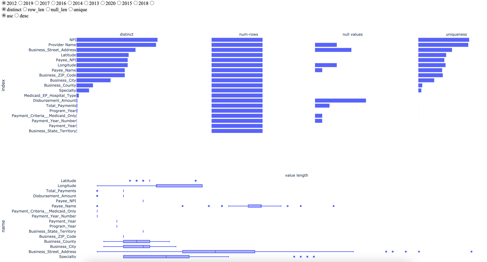

    

    🇨🇳 中文文档
    |
    🇬🇧 <a target="_blank" href="README.md">English Version</a>

    <strong>电子健康记录（EHR）数据集的可视化数据分析工具</strong>

---

## 👀 背景

> 电子健康记录（EHR）数据集往往包含数百万条记录，涉及的变量可能包含数万个不同的代码。目前，用于剖析数据的数据挖掘方面的技术已经十分成熟，并且可以通过 Pandas 等工具来实现。但是，这只能用到基本的可视化技术（例如直方图、散点图等）来帮助分析人员去了解数据。而更为先进的商业化可视化工具如 Tableau 等则主要是为了让用户获得更高层次的概况，并且深入研究和探索数据。它支持基本类型的分析，但并不支持电子健康记录（EHR）等复杂性的数据，因为这些数据的特点是杂乱无章的纵向序列事件（例如诊断、疗程、处方等变量）。

## 🎯 目标

这个项目的目的是研究有效的可视化技术，用于分析 EHR，并且通过 Python 来实现。为此，本项目会使用基于 sparkline-type 或者 glyphs 的方法，让用户能够一次可视化出数百个变量的描述性统计。描述性统计（参考 Abedjan 等人 2015 年的论文）包括 cardinalities（例如空值和唯一性），distributions（例如 whole value 和 first digit），模式（如格式和字符集）以及字段对的比较（比如住院和出院日期等）。本项目能够让用户对显示的数据进行交互式的排序和过滤，进行简单的汇总（例如合并字段或者描述一个电子健康记录代码的前 N 个字符），并同时显示数据的多个字迹（例如不同的年份）的可视化效果。

## 🚀 使用方法

1. 使用 Pycharm 打开本项目，在 terminal 里输入`python manage.py runserver`
2. 在浏览器的网址里输入`localhost:8080/datagrid`，上传`EHR_statistic_app`目录下的`test_data.csv`文件，顶栏`Provider Name`选择`Program_Year`或者`Payment_Year`，然后点击`Submit`按钮，即可看到可视化分析后的界面

## 🖥 截图

## 📝 参考文献

* Abedjan, Z., Golab, L., & Naumann, F. (2015). Profiling relational data: a survey. The VLDB Journal, 24(4), 557-581.
* Ruddle, R. A., & Hall, M. S. (2019). Using miniature visualizations of descriptive statistics to investigate the quality of electronic health records. Proceedings of the International Conference on Health Informatics (HEALTHINF). https://raruddle.files.wordpress.com/2019/01/ruddle-healthinf-2019.pdf