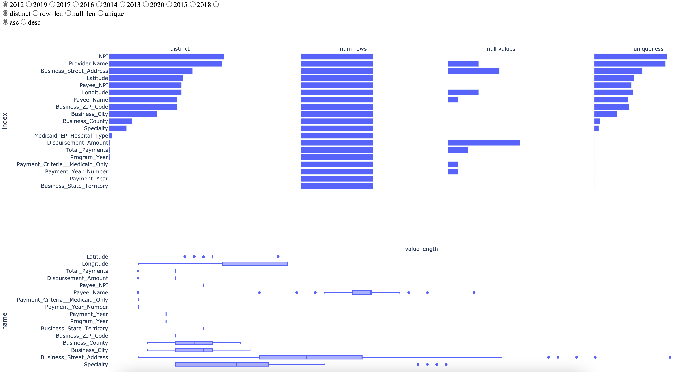

# Visualization-EHRs
A visual data profiling tool for Electronic Health Records (EHRs) dataset.

## 🚀 Quick start

1. 使用 Pycharm 打开本项目，在 terminal 里输入`python manage.py runserver`
2. 在网址里输入`localhost:8080/datagrid`，上传`EHR_statistic_app`目录下的`test_data.csv`文件，顶栏`Provider Name`选择`Program_Year`或者`Payment_Year`，然后`Submit`，即可看到可视化分析后的界面

## 🖥 Screenshot

